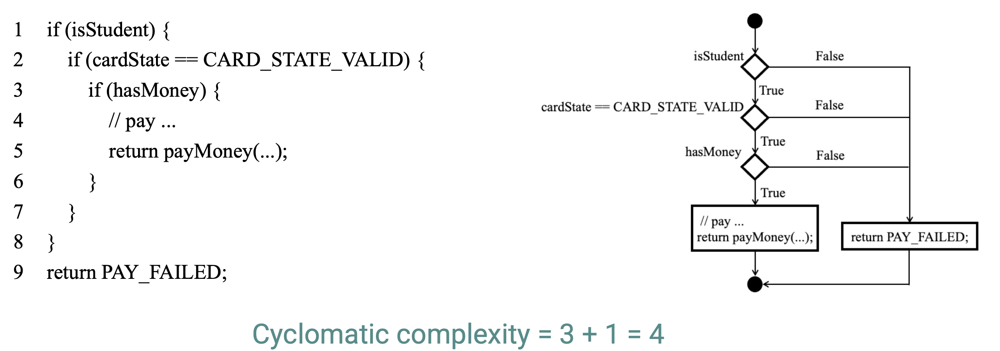

# SUSTech CS304: Final Review

[TOC]

## 1. Overview

**Hyrum Rule**: even though you may design your API for extensibility and count on being able to evolve it, things can become more complicated.

**Deprecation:** Having a dedicated group of experts execute the change **scales better** than asking for more maintenance effort from every user

## 2. Process

- Plan-driven processes: All process activites are planed and measured against the plan.
- Agile processes: plaing is incremental. Easier to change.

You need to find a balance between them.

### Process Models

**The Waterfall Model （瀑布模型）**

- a systematic and **sequential** model 一个系统的、顺序的模型

- Requirement（需求定义） -> design （设计）-> implementation （实现）-> testing （测试）-> deployment （部署）-> maintenance（维护）
- before pre-stage tasks finished, folloeing-stage tasks should not begin. 上一个阶段完成前，下一个阶段的工作不应该开始。

**问题：**

- 顺序模型: 很难处理变化
- 需求定义: 客户不可能一次性讲清楚所有需求
- 客户耐心: 项目只能在较后期时才能被交付使用

**Incremental Process Model （增量过程模型）**

- 多个线性序列
- 每个线性序列都能够产生一个可交付的软件
- 第一个序列一般是解决基本需求的核心产品，后续的增量序列为第一个版本补充功能

**问题:**

- 除非经常重构代码，否则处理后续引入的增量会越来越难
- 定期引入的增量很可能**破坏软件原本结构**。

**Evolutionary Process Models进化过程模型**

- ProtoTyping (原型设计): **当需求不明确时**, 先设计一个质量较低的原型.
  - 客户可以快速看到软件的工作版本并给出反馈
  - 原型一般会被丢弃(至少部分)
- Spiral Model: 以一个原型为迭代起点,不断迭代,产生越来越完整的工程.

### Agile development

- Extreme Programming (极限编程): 可能是第一个众所周知的敏捷过程.
- Scrum
- KANBAN

贴上chatgpt的回答:

**极限编程（Extreme Programming, XP）**： 极限编程是一种敏捷开发方法，特别强调程序员团队之间的紧密协作。其核心理念包括持续集成，测试驱动开发（TDD），以及配对编程。极限编程重视代码质量和可维护性，但需要团队的高度自律和协作。

**Scrum**： Scrum是另一种敏捷开发方法，它将项目分解为一系列的“Sprint”，每个Sprint的长度通常是2-4周。每个Sprint开始时，团队会规划在此期间要完成的工作（即Sprint Backlog），并在Sprint结束时进行复盘和评估。Scrum注重团队成员之间的协作与沟通，并由Scrum Master来协调和引导团队进行自我组织。

**看板（Kanban）**： Kanban源于日本的汽车生产线，是一种通过可视化工作流来跟踪任务进度的方法，通常以看板（Board）的形式实现。看板将工作流分为几个阶段，如“待办”、“进行中”、“已完成”。团队成员可以根据任务在看板上的位置，快速了解任务的当前状态和整个项目的进展。Kanban主要关注如何更有效地管理和优化工作流，减少瓶颈，提高效率。

### DevOps

强调开发团队和运维团队经常沟通

## 3. Version Control System

### Local VCS: RCS

将文件之间的差异保存在磁盘上

**缺点:** 无法协作.

### Centralized VCS

- 包含所有文件的服务器
- 以及签出了当前文件快照的客户端

### Distributed VCS

- 客户端不止签出文件快照,而是完全颈项储存库

### Git

- Git 储存快照, 而不是差异

-  若文件没有改变, 则只会储存一个链接到之前已经储存的相同文件的链接.

  

## 4. Requirements

### StakeHolders (涉众)

- **Primary StakeHolders (主要利益相关者)**: 
  - Customers (客户)
  - Project Managers (项目经理)
  - Business Analysts (业务分析师)
  - Develop Team (开发团队)
  - UI/UX designers (UI/UX 设计师) 
- **Secondary StakeHolders (次要利益相关者)**
  - End-users (最终用户)
  - Government (政府)
  - Cometitors  (竞争对手)

### Requirement Types (需求分类)

- **Functional Requirements** (功能性需求) : 系统需要实现的功能. 以输入-> 操作 -> 输出 的形式描述或说明.

  e.g. 

  - 按照关键字检索图书

  - 对于格式不正确的输入进行提示并请用户重新输入
  - ...

- **Non-Functional Requirements.** (非功能性需求): 定义软件质量属性与影响客户体验的功能等.

  e.g.

  - 性能

  - 可靠性

  - 安全性

  - 易用性

  - 产品约束 (如要求在linux系统上运行)

  - 过程约束 (如在5个月内交付)

    

### Requirements Model

- Scenerio-base elements (场景元素)
  - Use-case .etc
- Behavioral elements (表现元素)
  - State Diagrame .etc
- Class-based elements (类元素)
  - Class Diagram .etc

### UML

参考课件 或 Leo-Adventure 的 OOAD复习资料https://github.com/Leo-Adventure/CS309-Object-Oriented-Analysis-and-Design

## 5. Design

### Design Model (设计模型)

- **Data/Class Design**:(数据设计) 

  设计数据存储方案, 设计数据库模式, 描述数据之间的关系

- **Architecture Design**: (架构设计)

  - **4+1架构视图模型** 逻辑, 实现, 运行, 部署 + 用例
    - 用例视图: 功能
    - Logical View(逻辑视图): 结构
    - Development View (实现视图, 又名开发视图) : 软件管理
    - Process View (进程视图): 性能
    - Deployment View (部署视图): 交付, 安装
  - **架构风格**
    - Data-centered architecture (数据中心结构)
    - Data-flow architecture (数据流结构)
    - Call-and-return architecture (调用-返回结构)
    - Layered architecture (分层架构)
    - Object-oriented architecture (面向对象结构)

- **Interface Design**: (接口设计)

  - UI 设计
  - 内部接口设计

- **Component-Level Design**: (组件设计)

### Design Concepts (设计概念)

- 抽象
- 设计模式
- 关注点分离
- 模块化
- 信息隐藏
- 功能独立性

### 面向对象设计理念

- Single Responsibility Principle (单一责任原则)

- Open-Closed Principle (开闭原则): 对扩展开放, 对修改关闭

- Liskov Substitution Principle (里氏替换原则): 超类的对象应当可以被子类的对象替换

- Law of Demeter (迪米特法则, 或最小知识原则): 每个单元只对其他单元有有限了解.

- Interface Segregation Principle (界面隔离原则): 客户端不应该接触它不需要的方法

- Dependence Inversion Principle (依赖倒置原则): 高级模块不应该从低级模块中导入任何东西.

  我们应该减少对特定实现的依赖, 而依赖于接口.

  

## 6. Build

### Types of Build System

- Task-based Build Systems (基于任务的构建系统)

  定义任务, 灵活且强大, 但难以保证正确性与并行性

- Artifact-based Build Systems (基于工件的构建系统)

  系统层面描述构建输入输出, 保证正确性, 易于并行

### Dependency

- Strict transitive dependencies. 不可出现间接依赖

### Semantic Versioning

格式: {Major}, {Minor}, {Patch}

Major: 现有API产生变更, 可能破坏现有的使用

Minor: 功能增加, 应当无破坏性

Patch: bug修复之类的细节更改, 风险极低

## 7. Quality

### Code Quality

- Code Clone (代码重复)

  Type 1: 完全复制

  Type 2: 存在变量重命名

  Type 3: 在2的基础上, 增加或修改了少量语句

  Type 4: 相同功能, 但不同表示的代码.

  - 重复检测技术

    - Text matching 文本匹配: 检测Type1, Type 2

    - Token sequence matching Token序列匹配: 检测Type1, Type 2

    - Graph matching 图匹配 检测Type1, Type 2, Type 3

- Reliability 可靠性
  - Input Validation 输入验证
  - Error Handling 错误处理
- Efficiency 效率
- Portability 可移植性

### Code Review

自动代码分析器 -> 发送给评审者 -> 评审者发表评论 -> 修改代码 -> 发送给评审者 -> ... -> 通过评审 -> 合并修改

## 8. Metrics

### Complexity

- **Line of Codes** (代码行数)

- **Cyclomatic Complexity** (圈复杂度): 代码中决策的数量( if, while. for 等 )

  计算: 

  - V(G) = P + 1 (P为有分支的节点数)

  - V(G) = E - N + 2 (E为边数, N为节点数)

  - Example: 

    

      
    

### Coupling and Cohesion

- **Martin Coupling Metrics: ** 衡量一个类使用了多少个不同的类
  - Ce: 传出耦合, 您依赖了多少个类
  - Ca: 传入耦合, 多少个类依赖您
  - $I = \frac{Ce}{Ca+Ce}$
- OO Metrics (面向对象度量)
  - Weighted Methods Per Class (WMC) 类加权方法
  - Depth of Inheritance Tree (DIT, 继承树的深度) : 类层次结构中节点与根结点之间的最大长度
  - Number of Children (NOC, 孩子数量)
  - Coupling Between Classes (CBO) 对象间的耦合
  - Response For a Class (RFC) 对一个类的响应
  - Lack of Cohesion in Methods (LCOM) (不是很懂, 会的同学欢迎提个PR捏)

## 9. Evolution

### Metrics about Maintainance

- Number of requests for corrective maintenance (纠正性维护 (即改出来bug) 的数量)
- Average time requried for impact analysis (影响分析所需要的平均时间)
- Average time taken to implement a change request. (change 发起需要的平均时间)

### Code Smells

- **Bloaters**: 代码臃肿, 一般随着程序发展逐渐累积
  - Long Method
  - Long Parameters

- **OO Abuser**: 不正确使用面向对象
  - Refused Bequest: 子类不需要父类提供的所有行为, 继承可能没有意义
  - Change Preventers: 如果修改某些地方, 则其他地方也必须修改
- **Couplers**: 代码耦合过高
  - Feature Envy: 代码访问一个对象的数据多余它自己的的数据
- **Dispensibles: **无意义的东西

## 10. Document

貌似没啥好记的 (绝对不是作者没时间写了)

## 11. Testing

### Concepts

- Test Case: 某个测试用例
- Test Suite 测试不同场景的某个任务
- **Unit Testing **单元测试: 测试某个组件是否工作正常
- **Integration Testing** 集成测试: 测试模块之间交互与行为是否正常
- **System Testing** 系统测试: 测试产品的可靠性是否满足业务规范 (由专门的测试团队进行)
- **Acceptance Testing** 验收测试: 测试能否正查为用户提供服务

### Techniques

- **Black Box Testing** 假设内部结构未知
  - **Pros** 简单, 结果逼真
  - **Cons** 覆盖率有限, 测试很可能不完整
- **White Box Testing** 代码内部逻辑已知
  - **Pros** 测试全面
  - **Cons** 需要专业技术, 且无法完美模拟真实世界

### Test Doubles

- Fakes  删除不必要的依赖. 例如: 测试数据库查询的语句可以使用本地数据库.本地数据库就是一个“Fake”
- Stubs  模拟某种状态.例如要测试当服务器返回404会怎么样, 可以用一个**总是返回404**的api模拟
- Mocks 类似stubs. 但增加了验证功能(看不太懂, 有大佬可以指点一下). 例如, 要测试一个上传文件的系统, 可以构建一个mock, 接受一个文件并断言上传的文件一定是正确的.

## 12. CI/CD

## 13. AI